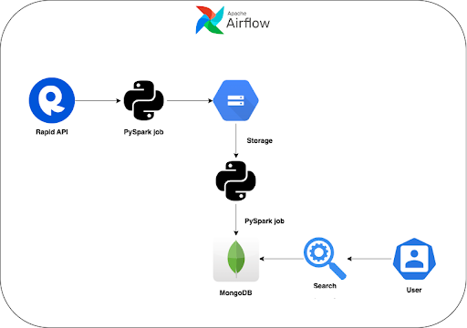

# Search Engine Pipeline

This repository contains a search engine pipeline using PySpark, MongoDB, and Airflow. The pipeline fetches product data from the ASOS API, stores the data in Google Cloud Storage (GCS) and loads the data into MongoDB. The pipeline also computes embeddings for the products using sentence transformer model, calculate cosine similarity score and calculates BM25 scores to rank the top 10 items.

## Architecture

  

## Table of Contents

- [Getting Started](#getting-started)
- [File Structure](#file-structure)
- [Usage](#usage)
- [License](#license)

## Getting Started

### Prerequisites

- Python 3.7 or later
- PySpark 3.0.1 or later
- MongoDB 4.2 or later
- Airflow 2.0.0 or later
- Google Cloud Storage

### Installation

1. Clone the repository
2. Change to the project directory: 
    `cd product-search-architecture`

3. Install the required Python packages (Either create a new environment with all the requirements or install specific ones): 
    `conda env create -f utils/environment.yml`

## File Structure

The repository contains the following files and directories:

- `utils/`: Helper functions and configurations
    - `product_indexing.py`: Fetches product data from the ASOS API and stores it in a GCS bucket
    - `gcs_to_mongo.py`: PySpark job to read data from a GCS bucket and load it into MongoDB
    - `user_definition.py`: Defines environment variables used across files
    - `helper.py`: Contains helper functions
    - `config.ini`: Stores the RapidAPI token and host details
    - `inverted_index.py`: Creates an inverted index of products for calculating BM25 scores
    - `environment.yml`: A yaml file containing all the requirements for the project
- `model/`: Model for calculating BM25 scores
    - `bm25.py`: Calculates BM25 scores and ranks the top 10 items
    - `BERT.py`: Computes embeddings and calculates cosine similarity score and ranks the top 10 items
- `dag/`: Airflow DAG for orchestrating the pipeline
    - `search_engine_dag.py`: Defines the DAG and tasks for the search engine pipeline

## Usage

To run the search engine pipeline, follow these steps:

1. Set up your Airflow environment and configure the necessary connections, variables, and secrets.
2. Copy the `search_engine_dag.py` file into your Airflow `dags` folder.
3. Start the Airflow web server and scheduler: 
    `airflow webserver --port 8080` 
    `airflow scheduler`

4. Open the Airflow web interface at `http://localhost:8080` and enable the `search_engine-airflow` DAG.
5. The pipeline will run according to the specified schedule, or you can manually trigger it from the web interface.

## License

This project is licensed under the MIT License - see the [LICENSE](https://opensource.org/license/mit/) file for details.

